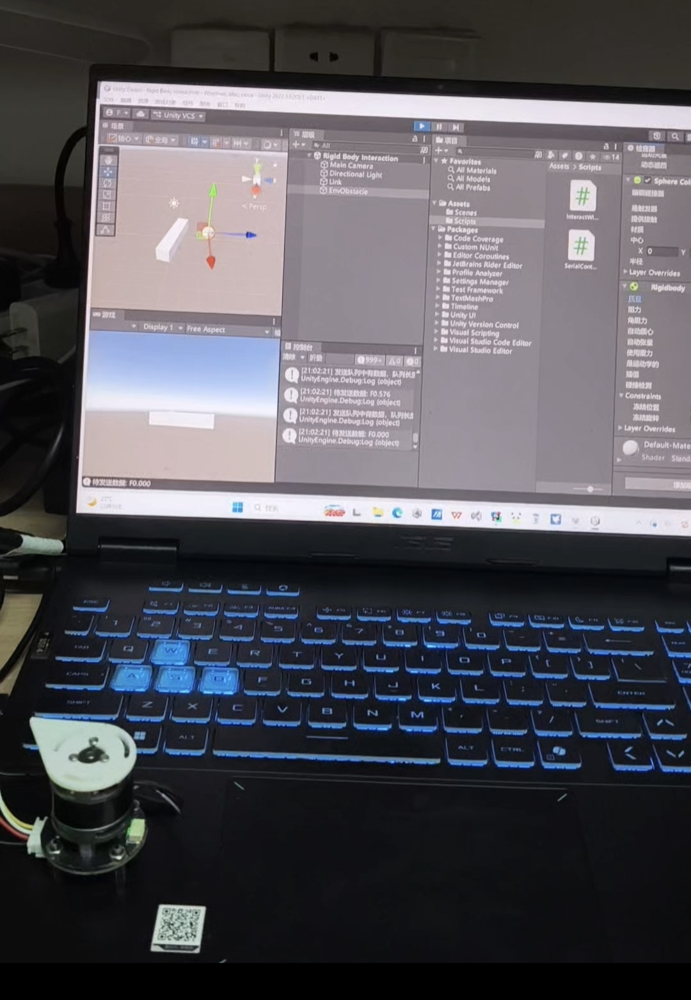

# 基于FOC力控算法的力反馈交互设备



本项目是一个力反馈交互设备演示demo，旨在验证力控算法在VR交互场景下的可行性。用户可转动无刷直流电机的输出摇臂，通过串口将电机的角位移同步到 unity 场景中的虚拟连杆上；当虚拟连杆与场景中的障碍物发生碰撞时，Unity 端会实时计算出反馈力矩并通过串口下发给 ESP32，电机随即输出反向力矩，让用户体验到"摸到"虚拟物体的感觉。

## 系统组成


<svg viewBox="0 0 680 284" width="100%" xmlns="http://www.w3.org/2000/svg" role="img">
<title>Unity 与 ESP32 之间的串口力矩控制链路</title>
<desc>Unity 物理仿真通过 USB 串口以 115200 8N1 向 ESP32 发送力矩指令 F 值，ESP32 通过 SimpleFOC 力矩控制以 PWM 驱动 BLDC 电机，AS5600 通过 I2C 回传角度，ESP32 再以每行一帧的角度数据回传给 Unity。</desc>
<defs>
  <marker id="arrow" viewBox="0 0 10 10" refX="8" refY="5" markerWidth="6" markerHeight="6" orient="auto-start-reverse">
    <path d="M2 1L8 5L2 9" fill="none" stroke="context-stroke" stroke-width="1.5" stroke-linecap="round" stroke-linejoin="round"/>
  </marker>
</defs>
<rect x="228" y="40" width="224" height="116" rx="12" fill="#F1EFE8" stroke="#B4B2A9" stroke-width="0.5" stroke-dasharray="4 4"/>
<text class="ts" x="340" y="60" text-anchor="middle" dominant-baseline="central" fill="#5F5E5A">串口 USB · 115200 8N1</text>
<text class="ts" x="340" y="82" text-anchor="middle" dominant-baseline="central" fill="#085041">角度（度，每行一帧）</text>
<path d="M436 96 H224" fill="none" stroke="#0F6E56" stroke-width="1.5" marker-end="url(#arrow)"/>
<text class="ts" x="340" y="120" text-anchor="middle" dominant-baseline="central" fill="#0C447C">力矩指令 F&lt;值&gt;</text>
<path d="M224 134 H436" fill="none" stroke="#185FA5" stroke-width="1.5" marker-end="url(#arrow)"/>
<rect x="40" y="66" width="180" height="64" rx="8" fill="#E6F1FB" stroke="#185FA5" stroke-width="0.5"/>
<text class="th" x="130" y="86" text-anchor="middle" dominant-baseline="central" fill="#0C447C">Unity 画面渲染</text>
<text class="ts" x="130" y="108" text-anchor="middle" dominant-baseline="central" fill="#185FA5">刚体物理仿真</text>
<rect x="440" y="66" width="200" height="64" rx="8" fill="#E1F5EE" stroke="#0F6E56" stroke-width="0.5"/>
<text class="th" x="540" y="86" text-anchor="middle" dominant-baseline="central" fill="#085041">ESP32 固件</text>
<text class="ts" x="540" y="108" text-anchor="middle" dominant-baseline="central" fill="#0F6E56">SimpleFOC 力矩控制</text>
<path d="M540 130 V200" fill="none" stroke="#0F6E56" stroke-width="1.5" marker-end="url(#arrow)"/>
<text class="ts" x="552" y="165" dominant-baseline="central" fill="#085041">PWM</text>
<path d="M470 200 V130" fill="none" stroke="#888780" stroke-width="1.5" marker-end="url(#arrow)"/>
<text class="ts" x="458" y="165" text-anchor="end" dominant-baseline="central" fill="#5F5E5A">I2C 角度反馈</text>
<rect x="440" y="200" width="200" height="64" rx="8" fill="#F1EFE8" stroke="#5F5E5A" stroke-width="0.5"/>
<text class="th" x="540" y="220" text-anchor="middle" dominant-baseline="central" fill="#2C2C2A">BLDC 电机 + AS5600</text>
<text class="ts" x="540" y="242" text-anchor="middle" dominant-baseline="central" fill="#5F5E5A">PWM 驱动 · 磁性编码器</text>
</svg>


- **ESP32 端**：基于 PlatformIO + Arduino 框架 + SimpleFOC 库，运行在 LOLIN32 Lite 开发板上。负责：
  - 通过 I2C 读取 AS5600 磁编码器的电机输出轴角度，并持续通过串口上报。
  - 通过串口接收 Unity 下发的力矩指令，以力矩控制模式直接驱动电机，并叠加速度阻尼项。


- **Unity 端**：Unity 工程，版本为**Unity 2022.3.62f3c1 (LTS)** ：
  - 串口通信：独立的 IO 后台线程，通过消息队列与线程锁处理数据的收发；启动时向 ESP32 发送握手命令 `S`；端口打开失败时自动枚举并尝试其他可用端口。
  - 游戏内的交互逻辑与动力学计算：
    - **无碰撞时**：虚拟连杆通过 `SmoothDampAngle` 平滑跟随真实电机角度。
    - **碰撞时**：按位置差计算力矩 `torque = Kp * Δθ`，一方面用 `AddTorque` 作用于虚拟刚体，另一方面把与之方向相反的力矩经串口下发给电机。
    - **物理帧率**：250 Hz，并开启刚体插值以降低视觉抖动。

## 目录结构

```
Interaction_Demo/
├── ESP32code/                    # ESP32 固件（PlatformIO 工程）
│   ├── platformio.ini            # 工程配置：lolin32_lite + Simple FOC 2.2.1
│   ├── src/main.cpp              # 当前固件：接收力矩指令并驱动电机、上报角度
│   └── my_bat/                   # 固件历史版本与调参笔记（.txt）
│       ├── mcu端用位置差控制力.txt        # 旧方案：位置差控制在 MCU 侧计算
│       ├── mcu端直接接收unity端发来的力.txt # 现方案备份
│       ├── 力矩PD控制器方法.txt           # PD 力矩控制器固件版本
│       ├── 参数对性能的影响.txt           # 调参经验记录
│       └── 电机控制游戏对象.txt
└── Unity Demo/                   # Unity 2022.3 LTS 工程
    ├── Assets/
    │   ├── Scenes/
    │   │   ├── Rigid Body Interaction.unity  # 刚体交互演示场景
    │   │   └── SampleScene.unity
    │   └── Scripts/
    │       ├── SerialController.cs     # 串口通信基类
    │       └── InteractWithVirtual.cs  # 游戏内的交互逻辑与动力学计算
    ├── Packages/manifest.json
    └── ProjectSettings/
```

## 硬件清单

| 部件 | 说明 |
|---|---|
| MCU | ESP32（LOLIN32 Lite 开发板） |
| 电机 | 无刷直流电机（BLDC），极对数 7 |
| 驱动 | 3 相 PWM 驱动，PWM 引脚 32 / 33 / 25，使能引脚 12，供电 12 V |
| 角度传感器 | AS5600 磁编码器，I2C 接口（SDA=19，SCL=18，400 kHz） |
| 通信 | USB 串口，115200 波特率 |

## 串口协议

| 方向 | 指令 | 说明 |
|---|---|---|
| ESP32 → Unity | `T<value>` | 目标角度指令，将编码器测得的电机输出轴角度通过串口同步到unity。 |
| Unity → ESP32 | `F<value>` | 目标力矩指令。力矩变化超过 0.005 阈值才发送，且有 0.005 死区抑制浮点噪声。 |

## 快速开始

### 1. 烧录固件

1. 安装 [PlatformIO](https://platformio.org/)（VS Code 插件或 CLI）。

2. 打开 `ESP32code/` 目录，依赖 Simple FOC 2.2.1 已在 `platformio.ini` 中声明，首次构建会自动下载。

3. 连接 LOLIN32 Lite，执行构建并上传。

4. 上电后串口应输出 `WAITING_FOR_START`，等待 Unity 握手。

### 2. 运行 Unity 演示

1. 用 Unity Hub 安装 **Unity 2022.3.62f3c1**（或同系列 2022.3 LTS）编辑器。

2. 打开 `Unity Demo/` 工程，加载场景 `Assets/Scenes/Rigid Body Interaction.unity`。

3. 在场景中选中挂有 `InteractWithVirtual` 脚本的对象，在 Inspector 中确认：
   - `Port Name` 为 ESP32 实际占用的串口（默认 `COM3`，打开失败会自动尝试其他端口）；
   - `Target Link` 指向用户可操作的连杆对象（Link）；`Env Obstacle` 指向环境障碍物对象。
   
4. 点击 Play：Unity 会在启动 0.5 s 后自动发送 `S` 握手，之后转动电机即可在虚拟场景中同步运动，碰到障碍物时电机输出反向力矩。

## 调参指南

### Unity 端

| 参数                       | 含义                       | 影响                                     |
| :------------------------- | :------------------------- | :--------------------------------------- |
| `Kp`                       | 位置差力矩增益             | 增益值越大反馈力越强，越不容易穿模，但更易超调导致电机或虚拟连杆震荡 |
| `Follow Smooth Time`       | 无碰撞跟随平滑时间         | 越小跟随越快、延迟越低                   |
| `Max Follow Speed`         | 无碰撞最大跟随速度         | 限制快速转动时的跟随速度                 |
| 刚体角阻尼                 | 虚拟连杆阻尼               | 越大抑振越强，但响应变慢                 |
| Link和障碍物的相对位置                      | 虚拟连杆的力臂           | 力臂越长，碰撞时作用在Link上的力矩越大，越不容易穿模 |


### ESP32 端

| 参数 | 含义 |
|---|---|
| `PID_velocity.P/I` | 速度环 PI 增益 |
| `P_angle.P` | 角度环 P 增益 |
| `voltage_limit` | 电机最大工作电压 |
| `velocity_limit` | 电机最大转速 |
| 速度阻尼系数 `0.05` | `motor.move()` 中叠加的速度负反馈，用于抑制震荡 |

> 更多调参经验见 `ESP32code/my_bat/参数对性能的影响.txt`：转速增益正反馈越大阻尼越小响应越快；负反馈有利于抑制震荡。

## 依赖环境

- **固件**：PlatformIO、`espressif32` 平台、Arduino 框架、`askuric/Simple FOC@2.2.1`
- **上位机**：Unity 2022.3.62f3c1 (LTS)，Windows（串口使用 `System.IO.Ports`，端口名形如 `COMx`）
- **Unity 包依赖**：TextMeshPro、Timeline、Visual Scripting 等（见 `Packages/manifest.json`，标准模板包）
- **Unity 项目设置**：将Api兼容级别改为: ".NET Framework"
